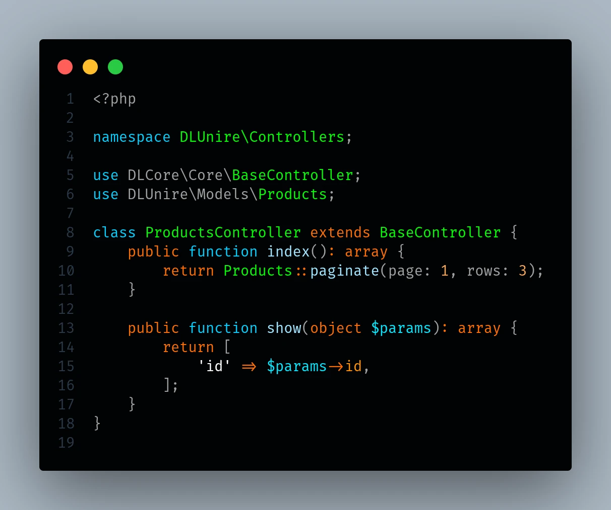

# DLUnire Dark

**Un esquema de color oscuro y de alto contraste para Sublime Text.**


---

> **Nota:** Este paquete es una adaptación del tema [DLUnire Dark para Visual Studio Code](https://github.com/dlunire/theme-dlunire-dark) al formato nativo de Sublime Text (`.sublime-color-scheme`). Las capturas de la galería corresponden al tema original en VS Code y se reutilizan aquí como referencia visual de la paleta, ya que ambos comparten los mismos colores y la misma clasificación semántica.

DLUnire Dark está pensado para desarrolladores que quieren un editor limpio y de alto contraste sin sacrificar consistencia semántica.

En lugar de colorear los tokens de forma arbitraria, el esquema agrupa las construcciones del lenguaje según su rol dentro del código. Esto hace que los proyectos complejos sean más fáciles de escanear, entender y navegar.

Fue refinado sobre proyectos reales del ecosistema **DLUnire Framework** y funciona bien en lenguajes modernos, con especial cuidado para PHP y TypeScript.

### Tipos de sintaxis de un vistazo

Una muestra compacta de gramática que muestra cómo se distinguen variables, tipos, cadenas, números, booleanos y comentarios:


---

## Tabla de contenidos

- [Resumen](#resumen)
- [Galería](#galería)
- [Características](#características)
- [Paleta de colores](#paleta-de-colores)
- [Lenguajes soportados](#lenguajes-soportados)
- [Instalación](#instalación)
- [Filosofía de diseño](#filosofía-de-diseño)
- [Repositorio](#repositorio)

---

## Resumen

DLUnire Dark sigue una idea simple:

> **El código fuente debe comunicar estructura antes que sintaxis.**

Cada construcción pertenece a una categoría visual estable. Palabras clave, tipos, funciones, propiedades y comentarios se mantienen visualmente distintos, de modo que los patrones resaltan más rápido y las sesiones largas resultan menos fatigantes.

El esquema comenzó pensado para PHP, y luego fue probado extensamente con stacks frontend modernos y lenguajes de sistemas.

### Objetivos principales

- Mejorar la legibilidad
- Mantener un coloreado semántico consistente
- Reducir la fatiga visual
- Resaltar las construcciones que importan
- Mantener la interfaz limpia y sin ruido visual

---

## Galería

Las capturas siguientes provienen de proyectos reales del ecosistema **DLUnire** — código de producción, no demos de juguete.

### TypeScript

Módulos principales, imports, declaraciones de tipos, funciones y comentarios.


---

### Svelte

Componentes, layouts, TypeScript embebido y estructura de la aplicación.


---

### SCSS

Variables, selectores, reglas anidadas, propiedades y mixins.


---

### TypeScript — Motor de enrutamiento

Un ejemplo más extenso de TypeScript que muestra enrutamiento, módulos y arquitectura de aplicación.


---

### Rust

Traits, ownership, módulos, macros y sintaxis moderna de Rust.


---

### PHP

Namespaces, clases, métodos, atributos y sintaxis moderna de PHP.


---

### Controlador PHP

Un controlador de producción construido con DLUnire Framework.



---

## Características

DLUnire Dark utiliza un sistema de color semántico en lugar de un resaltado de sintaxis arbitrario.

### Aspectos destacados

- Fondo ultra oscuro (`#010305`)
- Resaltado de sintaxis de alto contraste
- Paleta equilibrada y cuidadosamente ajustada
- Clasificación semántica de la sintaxis
- Cómodo para sesiones de codificación largas
- Identidad visual clara para:
  - Palabras clave
  - Clases
  - Interfaces
  - Traits
  - Enums
  - Funciones
  - Métodos
  - Variables
  - Propiedades
  - Atributos
  - Tipos primitivos
  - Constantes
  - Literales numéricos
  - Comentarios
- Comentarios sin cursiva
- Interfaz del editor consistente
- Distracciones visuales mínimas
- Ajustado para lenguajes modernos

---

## Paleta de colores

| Elemento          |   Color   | Propósito                                    |
| ------------------ | :-------: | --------------------------------------------- |
| Fondo               | `#010305` | Fondo ultra oscuro del editor                  |
| Texto por defecto   | `#FFFFFF` | Cadenas y primer plano del editor              |
| Palabras clave      | `#FF6D00` | Control de flujo y modificadores               |
| Declaraciones       | `#00D0FF` | Funciones, namespaces y declaraciones          |
| Clases              | `#00FF00` | Clases, interfaces, traits y namespaces        |
| Funciones           | `#A0E5FF` | Funciones y métodos                            |
| Variables           | `#00E8FF` | Variables y parámetros                         |
| Propiedades         | `#FF9100` | Propiedades de objetos                         |
| Atributos           | `#F50057` | Atributos del lenguaje                         |
| Tipos primitivos    | `#FFC600` | Tipos incorporados del lenguaje                |
| Etiquetas HTML/XML  | `#1DE9B6` | Elementos HTML/XML                             |
| Constantes          | `#A0A0FF` | Constantes del lenguaje y booleanos            |
| Números             | `#FAA859` | Literales numéricos                            |
| Comentarios         | `#656565` | Comentarios sin cursiva                        |

---

## Lenguajes soportados

DLUnire Dark funciona con cualquier lenguaje soportado por Sublime Text (mediante sus respectivos paquetes de sintaxis). Se puso especial atención en:

- PHP
- TypeScript
- JavaScript
- Svelte
- Rust
- HTML
- CSS
- SCSS
- JSON
- Markdown

> Para Svelte, TypeScript avanzado u otros lenguajes sin soporte nativo en Sublime Text, se recomienda instalar el paquete de sintaxis correspondiente (por ejemplo, vía Package Control) antes de aplicar el esquema de color, para obtener un resaltado semántico completo.

Las imágenes de la galería fueron capturadas en proyectos reales de **DLUnire**.

---

## Instalación

### Mediante Package Control (recomendado)

1. Abre la paleta de comandos (`Ctrl + Shift + P` en Windows/Linux, `Cmd + Shift + P` en macOS).
2. Escribe **Package Control: Install Package** y presiona `Enter`.
3. Busca **DLUnire Dark** y selecciónalo.
4. Ve a **Preferences → Color Scheme…**
5. Selecciona **DLUnire Dark**.

### Instalación manual

1. Descarga o clona el repositorio.
2. Copia el archivo `DLUnire Dark.sublime-color-scheme` a tu carpeta de paquetes de usuario:
   - **macOS:** `~/Library/Application Support/Sublime Text/Packages/User/`
   - **Linux:** `~/.config/sublime-text/Packages/User/`
   - **Windows:** `%APPDATA%\Sublime Text\Packages\User\`
3. Ve a **Preferences → Color Scheme…**
4. Selecciona **DLUnire Dark**.

---

## Desarrollo y publicación

### Probar el esquema localmente antes de publicar

1. Abre **Preferences → Browse Packages…** en Sublime Text. Esto abre la carpeta `Packages` de tu instalación (no `Packages/User`).
2. Clona ahí el repositorio con el nombre exacto que quieres que tenga el paquete:
   ```bash
   git clone https://github.com/dlunire/dlunire-dark-theme-sublime.git "DLUnire Dark"
   ```
3. Abre **Preferences → Color Scheme…** y selecciona **DLUnire Dark**.
4. Abre archivos reales de PHP, TypeScript, Rust, HTML/SCSS y Markdown para verificar el resultado visual contra la paleta.
5. Usa **Tools → Developer → Show Scope Name** (`Ctrl+Alt+Shift+P` en Windows/Linux, `Cmd+Ctrl+Shift+P` en macOS) sobre cualquier token para confirmar que el scope bajo el cursor coincide con el que definiste en `rules`.
6. El `.sublime-color-scheme` se recarga en caliente al guardar — puedes editarlo directamente dentro de esa misma carpeta clonada y ver los cambios sin reiniciar Sublime Text.

### Publicar en Package Control

1. Asegúrate de que el repositorio en GitHub contenga **solo este paquete** en la raíz (sin subcarpetas intermedias), incluya `LICENSE`, `README.md` y el `.sublime-color-scheme`, y **no** incluya `package-metadata.json` ni archivos `.pyc`.
2. Crea un tag con versión semántica en el repo (sin prefijo `v`, por ejemplo `1.0.0`) y publícalo:
   ```bash
   git tag 1.0.0
   git push origin 1.0.0
   ```
   Package Control detecta automáticamente los tags con formato `MAJOR.MINOR.PATCH` como nuevas versiones publicables.
3. Haz un fork de [`sublimehq/package_control_channel`](https://github.com/sublimehq/package_control_channel).
4. Dentro de tu fork, agrega una entrada en `repository/<letra>.json` (la letra inicial del nombre del paquete, en este caso `d.json`):
   ```json
   {
       "name": "DLUnire Dark",
       "details": "https://github.com/dlunire/dlunire-dark-theme-sublime",
       "releases": [
           {
               "sublime_text": "*",
               "tags": true
           }
       ]
   }
   ```
5. Instala el paquete **ChannelRepositoryTools** vía Package Control, abre tu fork de `package_control_channel` en Sublime Text y ejecuta desde la paleta de comandos **ChannelRepositoryTools: Test Default Channel** para validar que el JSON esté bien formado antes de enviarlo.
6. Sube los cambios y abre un **Pull Request** hacia `package_control_channel`, siguiendo la plantilla/checklist del repositorio.
7. Un bot (`package_reviewer`) evaluará automáticamente el PR; corrige cualquier error que reporte (nombres de archivo, descripción del repo, ausencia de archivos innecesarios, etc.).
8. Una vez aprobado y fusionado el PR, el paquete queda disponible públicamente vía **Package Control: Install Package** en cualquier instalación de Sublime Text.

> Para futuras versiones basta con crear un nuevo tag semántico (`1.1.0`, `2.0.0`, etc.) en el repositorio — no es necesario volver a tocar `package_control_channel`.

---

## Filosofía de diseño

Los lenguajes de programación son sistemas estructurados. Un esquema de color debe reforzar esa estructura, no ocultarla.

DLUnire Dark asigna colores según el rol semántico de cada construcción. Así se detectan patrones más rápido, se entiende el código con mayor facilidad y se mantiene una apariencia limpia y consistente entre lenguajes.

En lugar de dar el mismo peso a cada token, el esquema resalta lo que define la arquitectura y el comportamiento del código.

---

## Repositorio

**Sitio web:** [https://dlunire.dev](https://dlunire.dev)

**Código fuente (Sublime Text):** [https://github.com/dlunire/dlunire-dark-theme-sublime](https://github.com/dlunire/dlunire-dark-theme-sublime)

**Código fuente (tema original, Visual Studio Code):** [https://github.com/dlunire/theme-dlunire-dark](https://github.com/dlunire/theme-dlunire-dark)

Los reportes de errores, solicitudes de funcionalidades y contribuciones son bienvenidos.

---

**Licencia:** MIT (misma licencia que el tema original `theme-dlunire-dark`) · **Publicado por:** [dlunire](https://dlunire.dev) · **Versión:** 1.0.1